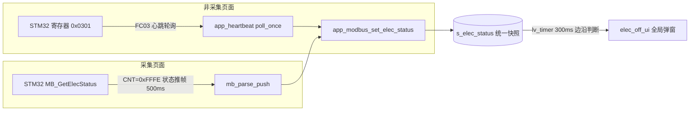

# 电极脱落全局提示弹窗（ESP32 + STM32 联动）

> 阶段：UI 全局提示　|　涉及：ESP32（本工程）+ STM32（`EDA_EMG`）+ PC 兼容
> 日期：2026-09　|　状态：ESP32 已编译通过；STM32 需 IAR 编译后联调

## 1. 需求与结论

- **现象**：电极（NNC6521 刺激电极 / ADS1292 采集电极）脱落时，屏幕要给用户一个提示。
- **交互（已与用户确认）**：
  1. **任何页面**检测到脱落都弹（菜单 / 设置 / 评估 / 治疗中都要）。
  2. **纯提示、单按钮**：只有一个「确定 / OK」，**不停治疗、不停采集、不改变任何治疗状态**。
  3. **边沿触发**：状态 `0 → 非0` 弹一次；电极贴好（回到 0）之前**不再重复弹**；贴好后重新武装。
  4. 采集期（治疗/评估，总线被 50Hz 推流占满）也要能提示 → **STM32 在推流里周期带出状态帧**。

> ⚠️ 安全提示：本功能**只提示、不自动停刺激**。脱落期间是否停波属于治疗策略，本需求明确不做。

## 2. 为什么需要两条数据通路

ESP32 是 Modbus 主站，平时靠 FC03 轮询读寄存器。但：

- **非采集页面**（菜单/设置等）：总线空闲，心跳每秒 FC03 读一次 → 顺带读 `0x0301` 即可。
- **采集页面**（评估/治疗）：进页面就 `emg_force_start_acq(500,1)`，STM32 以 50Hz 主动推数据帧，
  此时 `mb_transact()` 直接返回 `MB_ERR_BUSY`，**FC03 轮询被拒绝**（响应帧还和推帧共用
  `01 03 ..` 帧头，插轮询有误切帧/吞波形风险，会污染力度引擎和曲线）。

所以采集期改由 **STM32 周期性在推流里插入一帧专用状态帧**，ESP32 解析后汇入同一份快照。



## 3. 状态帧协议（新增）

复用 FC03 推帧外形，用保留 CNT 魔数区分：

```
[01][03][BC=04][CNT_H=FF][CNT_L=FE][ELEC_H][ELEC_L][CRC_L][CRC_H]   共 9 字节
```

| 字段 | 值 | 说明 |
|---|---|---|
| SlaveID | `0x01` | |
| FC | `0x03` | 复用读保持寄存器功能码 |
| BC | `0x04` | 后随 4 字节（CNT 2B + ELEC 2B） |
| CNT | `0xFFFE` | **状态帧魔数** `MB_PUSH_CNT_ELEC` |
| ELEC | `0x0301` 位图 | 0=正常，非0=有脱落 |

CNT 取值互不冲突：**数据帧 CNT=1~50、按键帧 CNT=0、状态帧 CNT=0xFFFE**。

**PC 端兼容**：`EDA_EMG_PC/src/modbus_client.py` 的 `_parse_push_frame` 对 `cnt<=0 or cnt>50`
的帧直接丢弃，因此 `0xFFFE` 状态帧**不会影响现有 PC 工具**（已核对）。

### ELEC 位图（与 STM32 `MB_RegMap.h` 逐位对齐）

| bit | 宏 | 含义 |
|---|---|---|
| 0x01 | `ELEC_STATUS_NNC_CH1_OFF` | NNC6521 CH1 刺激电极脱落 |
| 0x02 | `ELEC_STATUS_NNC_CH2_OFF` | NNC6521 CH2 刺激电极脱落 |
| 0x04 | `ELEC_STATUS_ADS_IN1P_OFF` | ADS1292 IN1P 采集电极脱落 |
| 0x08 | `ELEC_STATUS_ADS_IN1N_OFF` | ADS1292 IN1N 采集电极脱落 |
| 0x10 | `ELEC_STATUS_ADS_IN2P_OFF` | ADS1292 IN2P 采集电极脱落 |
| 0x20 | `ELEC_STATUS_ADS_IN2N_OFF` | ADS1292 IN2N 采集电极脱落 |

## 4. 代码改动清单

### STM32（`D:\GitLab\EDA_EMG`，IAR）

- `code/MODBUS/MB_RegMap.h`
  - 新增 `MB_ELEC_PUSH_INTERVAL_MS 500`、`MB_PUSH_CNT_ELEC 0xFFFE`。
  - 声明 `uint16_t MB_Reg_PushElecFrame(uint8_t *pFrame);`
- `code/MODBUS/MB_RegMap.c`
  - 新增 `MB_Reg_PushElecFrame()`：组 `[01 03 04 FF FE ELEC_H ELEC_L CRC]`，
    ELEC 取 `MB_GetElecStatus()`（与寄存器 0x0301 同源：NNC6521 LOD + ADS1292 LOFF）。
- `code/MODBUS/MB_Slave.c`
  - 新增静态 `s_ulElecTick` / `s_ucElecBuf[16]`。
  - `MB_Slave_TimeScand()` 推流块之后：**仅 `ADS1292_IsAcqReady()` 为真（正式采集）**时
    每 500ms 构建一帧状态帧，推送到所有已启用通道（ESP=USART3，PC 仿真=USART2）；
    非采集期清零计时（下次启动采集后立即推一帧）。

> 用 `ADS1292_IsAcqReady()` 而非 DEV_STATUS：它明确排除上电自检（ucVerifyMode），
> 只在正式采集时为真，避免自检阶段误推。

### ESP32（本工程）

- `main/MODBUS/app_modbus_reg.h`
  - 新增 `MB_ELEC_PUSH_INTERVAL_MS`、`MB_PUSH_CNT_ELEC` 与 6 个 `ELEC_STATUS_*` 位宏。
- `main/MODBUS/app_modbus.c` / `.h`
  - 新增统一快照 `static volatile uint16_t s_elec_status` + `s_elec_valid`。
  - `mb_parse_push()` 增加 `cnt == MB_PUSH_CNT_ELEC` 分支 → 写快照（采集期来源）。
  - 公共 API：`bool app_modbus_get_elec_status(uint16_t *out)`、
    `void app_modbus_set_elec_status(uint16_t)`（非采集期心跳回填）。
  - 定帧无需改：状态帧 BC=4，`mb_rx_drain()` 走 `3+BC+2=9` 路径（CNT 非0，不进按键帧分支）。
- `main/heartbeat/app_heartbeat.c`
  - `poll_once()` 末尾（已过 push/OTA/总线静默三道闸，说明正处于非采集空闲页）
    FC03 读 `0x0300` 起 2 个寄存器，`vals[1]`（=0x0301）回填快照。
- `tools/gen_elec_font.js`（**新脚本**）+ `spiffs_data/png/font/lv_font_Elec.bin`（**新字库**）
  - 同事子集字库 `lv_font_Btn.bin`(size15) 不含弹窗新文案的 脱/落/检/查/贴 等字 → 豆腐块。
  - 仿 OTA 页 `gen_ota_font.js` 先例，用 `lv_font_conv` 从 SimHei 生成 **size15/bpp4** 子集字库
    （只收 13 字：`电极脱落请检查是否贴好确定`，4KB），字号与 Btn 一致、视觉统一。
  - 重新生成：`node tools/gen_elec_font.js`。
- `main/ui/basic.h` / `basic.c`
  - `Basic_Widget_t` 加 `Chinise_Font_Elec`；`chinese_font_init()` 加载 `lv_font_Elec.bin`，
    失败回退 Btn（新字豆腐块但不崩），并打 OK/FAIL 日志。
- `main/ui/elec_off_ui.c` / `.h`（**新文件**）
  - `elec_off_ui_init()` 建 300ms `lv_timer`；回调读快照做边沿判断。
  - 弹窗挂 **`lv_layer_top()`**（所有页面都在 `g_Ui.page_container` 里，切页会
    `lv_obj_clean(page_container)`；挂顶层才不被切页清掉）。
  - 单「确定/OK」按钮，按语言中英文；ENTER 或点按关闭，ESC 也关闭。
  - **中文标签/按钮用 `basic_widget.Chinise_Font_Elec`**（专用子集字库，含脱/落/检/查/贴），
    英文仍用 `lv_font_montserrat_14`。
  - 弹窗显示期间 `lv_group_focus_freeze(g, true)`：物理方向键不再把焦点切到页面按钮，
    避免治疗中误触页面控件；关闭时解冻。已核对 LVGL v9 源码：freeze 只阻止焦点切换，
    `lv_group_send_data()` 仍把 KEY 发给当前焦点按钮，故 ENTER/ESC 照常关窗。
- `main/app_main.c`
  - `ui_load_timer_cb()` 在 `Frame_ui()` + `Ui_EnterMenu()` 之后调 `elec_off_ui_init()`。
- `main/CMakeLists.txt`：**无需改**（`ui` 已在 SRC_DIRS/INCLUDE_DIRS，新 .c 自动纳入）。

## 5. 关键设计点 / 踩坑

1. **弹窗必须挂 `lv_layer_top()`**，不能挂 page_container，否则一切页就被 `lv_obj_clean` 清掉。
2. **边沿触发在 UI 层做**（`s_prev_off`），而不是收到非0就弹：否则采集期 500ms 一帧、
   非采集期 1s 一帧，会反复弹窗。回到 0 才重新武装。
3. **弹窗期冻结 group 焦点是安全关键**：否则方向键会把焦点移到治疗页按钮，按确认可能误停/误调。
4. **状态帧魔数选 >50**：天然被 PC 端解析器忽略，三端（ESP/PC/STM32）共存无需 PC 改版。
5. **两条通路写同一份快照**，UI 只读快照，不关心来源，采集↔非采集切换无缝。
6. 弹窗为**纯提示**，不调用任何 `therapy_stop/pause`，符合"不停治疗"的明确需求。
7. **新增中文文案必须同步补子集字库**：同事 Btn 字库是裁剪子集，新汉字（脱/落/检/查/贴）
   不在其中会显示豆腐块。做法见 `tools/gen_elec_font.js`（改文案后把新汉字加进 CN 串重跑）。
8. **字库在 SPIFFS(storage) 分区，不在 app 里**：改字库后必须**全量烧录（含 storage_a/storage_b）**，
   只「烧 app」不会更新字库，现象是代码对了但仍豆腐块。build 会自动重建 storage_*.bin。

## 6. 验证方法

- **字库**：全量烧录后开机日志应有 `Elec font loaded OK (lv_font_Elec.bin)`；
  若见 `Elec font load FAIL ... fallback Btn` 说明 storage 没随固件烧录。
- **非采集页**：console 输入 `mb status` 可即时读 `ELEC=..`（非推流时可用）；
  拔掉电极 → 菜单页应弹一次；不拔回（不回0）不再弹；插好后再拔可再弹。
- **采集页（治疗/评估）**：开始采集后拔电极，最长约 500ms（状态帧周期）+300ms（UI 轮询）
  内弹窗；治疗波形/力度引擎不应受影响。
- **切页**：弹窗显示中按返回切页面，弹窗仍在（顶层），确定后关闭且焦点恢复正常。
- **PC 工具**：采集期 PC 端不应因 0xFFFE 帧报解析错误/断流。

## 7. 待办 / 风险

- [ ] STM32 端用 IAR 编译（本机无法编译 IAR），确认无警告后烧录联调。
- [ ] 真机验证 NNC/ADS 各通道脱落位图与实际电极对应关系。
- [ ] 若后续产品要求"脱落自动停刺激"，需另立需求（本版本刻意不做）。
