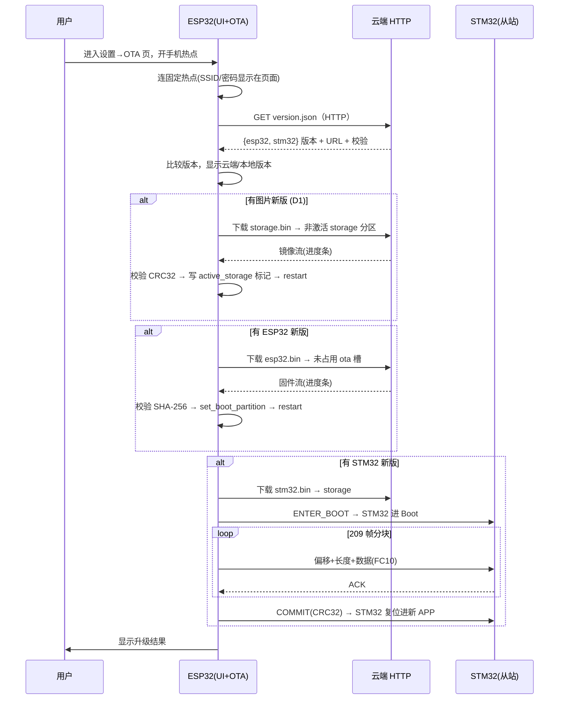

# 0U OTA 在线升级计划（阶段 D）

> 阶段 OTA：ESP32 + STM32 双目标在线升级。
> 本文是**计划文档**，只做规划与决策，**未正式编码前不得动工**。
> 交叉引用：主文档 `doc/开发计划.md`；Modbus 治疗控制见 `doc/阶段C_笔记/0T_UI对接Modbus治疗控制.md`。

---

## 0. 需求概述（用户构思原文）

1. ESP32 界面**设置页下新增「OTA 升级」菜单**，进入后显示 ESP32 默认连接的**固定热点名称 + 密码**，用户开手机热点让 ESP32 连上。
2. 联网成功后通过 **HTTP** 获取云端最新版本信息，并**显示云端版本**。
3. 页面分别展示 **ESP32 版本信息** 与 **底层 STM32 版本信息**。
4. 有新版则**自动下载固件**。
5. 升级顺序：**先 ESP32，再 STM32**。

---

## 1. 两侧现状（实测数据）

| 目标 | 项目 | 现状 |
| --- | --- | --- |
| **ESP32** | 芯片/模组 | esp32s3 / WROOM-1-N16R8（16MB Flash + 8MB PSRAM） |
| | IDF | v5.5.3，LVGL 9.5 + esp_lvgl_port 2.8，事件驱动 |
| | app 固件体积 | **`eda_emg_esp32.bin` = 1050.6 KB** |
| | 图片固件 | **`storage.bin` = 12 MB**（SPIFFS，真实数据 ~4.26 MB） |
| | 现有分区 | `nvs(16K)` / `phy_init(4K)` / `factory(4MB)` / `storage(12MB)`，**无 OTA 双区** |
| | WiFi/HTTP | **无**（需新增 esp_wifi + esp_netif + esp_http_client / esp_https_ota） |
| | 版本来源 | `main/idf_component.yml` `version: "0.1.0"`，无全局 C 宏 |
| **STM32** | 芯片 | STM32F407VE（512KB Flash） |
| | APP 体积 | **≈ 50 KB**（readonly 46180 B + 3653 B；readwrite 39273 B 在 RAM） |
| | 链接布局 | ROM 0x08000000~0x080FFFFF，intvec 从 **0x08000000** 起（**无 boot 区**） |
| | Flash 规划 | `Param.h` 枚举已预留：`BOOT_TOTAL_SIZE=8KB`、`AppStarAdrs=0x08002000`（**boot 区未实现**）；`ParamAdrs=512KB-1KB`（参数）、`OTAParamAdrs=ParamAdrs-1KB`（OTA 参数区） |
| | Modbus 角色 | RTU **从站 0x01**（USART2 PA2/PA3，115200 8N1，与 ESP32 主站对接） |
| | Modbus 缓冲 | `MB_RX_BUF_SIZE=256` / `MB_TX_BUF_SIZE=256`（`MB_Slave.h`）→ **FC10 单帧数据 ≤246 字节** |
| | 版本来源 | `MB_GetFwVersion()` **硬编码 0x0100（v1.0）**（`MB_RegMap.c`） |
| | 现有 OTA 代码 | `CommCmd.c` 内 `BootLoad_F0()` + `COMCMD_Recv` 为 **`#if 0` 死代码**，SAPP 无版本字段，不可复用 |

### 关键体积结论
- **STM32 APP 仅 50KB**：可以「整包先下载到 ESP32，再二次 Modbus 分块下发」，无需流式边下边烧。
- **ESP32 APP 1050KB**：双区 OTA 每区至少 1.5~2MB 才安全。
- **图片 12MB（真实 4.26MB）**：若每次 OTA 重传图片极慢，需决策「图片是否参与 OTA」。

---

## 2. ESP32 分区表重组方案

> 当前 `partitions.csv`：`nvs(0x9000,16K)` + `phy_init(0xd000,4K)` + `factory(0x10000,4MB)` + `storage(0x410000,12MB)`。
> 目标：引入 **`ota_0`/`ota_1` 双区**（OTA 必需）+ **图片双区**（`storage_a`/`storage_b`，满足 D1 图片参与 OTA）。16MB 总量约束如下。

### 采用分区（app 双区 OTA + 图片双区 OTA）

| 分区 | 类型 | 子类型 | 偏移 | 大小 | 说明 |
| --- | --- | --- | --- | --- | --- |
| nvs | data | nvs | 0x9000 | 16K | 参数 + **active storage 标记** |
| phy_init | data | phy | 0xd000 | 4K | 射频参数 |
| **ota_0** | app | ota_0 | 0x10000 | **2MB** | app 槽 A |
| **ota_1** | app | ota_1 | 0x210000 | **2MB** | app 槽 B |
| **storage_a** | data | spiffs | 0x410000 | **~5.97MB** | 图片镜像 A（0x5F8000） |
| **storage_b** | data | spiffs | 0xA08000 | **~5.97MB** | 图片镜像 B（0x5F8000） |

> 容量核算（16MB = 0x1000000）：`nvs+phy(20K) + ota_0/ota_1(4MB)` 后剩 `0xBF0000 ≈ 12.25MB`，
> 均分给两个 storage = 各 `0x5F8000 ≈ 5.97MB`（`storage_b` 尾端刚好贴住 0x1000000，无浪费）。

- ota_0/ota_1 各 2MB：容纳 1050KB 固件，余量充足。
- storage_a/storage_b 各 5.97MB：图片全集 4.26MB + SPIFFS 开销会占 ~4.5MB，余量 ~1.4MB（**偏紧**，见下方风险）。
- **图片双区切换**：nvs 存 `active_storage`（0=A / 1=B）；开机按标记挂载对应分区为 `/spiffs`；OTA 时整刷非激活分区 → 写入新标记 → 重启后自动切到新图。

### 图片 OTA 机制（D1 = 图片参与 OTA）

- **整刷镜像**（推荐）：云端放 `storage.bin`（SPIFFS 镜像，5.97MB）。ESP32 下载 → `esp_partition_write()` 整刷到**非激活** storage 分区 → 校验 CRC32 → 写 nvs `active_storage` 标记 → 重启。
  - 优点：简单可靠，断电/失败只损坏非激活分区，激活区不受影响，可重试。
  - 缺点：下载 5.97MB 比真实数据 4.26MB 大（镜像含空块）。
- **逐文件写入**（备选，暂不采用）：云端放文件清单 + 逐文件 HTTP，ESP32 逐个写 SPIFFS。下载量小（~4.26MB）但需维护清单、写 SPIFFS 逻辑复杂、失败恢复难，**本期不做**。

> 切换迁移成本：改 `partitions.csv` 后需**整机重烧**（含 storage 图片），老设备在线 OTA 需先 USB 线刷一次升级到新分区布局，之后才能走 OTA（首版 OTA 不可避免）。

---

## 3. 版本信息格式

统一 BCD 风格 `0xMMmm`（MAJOR.MINOR），与 STM32 现有 `0x0100` 一致：

| 目标 | 云端清单字段 | 本地火山版本来源 | 说明 |
| --- | --- | --- | --- |
| ESP32 | `esp32: { version: "0.1.0", url: "...", sha256:"..." }` | 新增 `APP_FW_VERSION` C 宏（0xMMmm） | 与 `idf_component.yml` 同步 |
| STM32 | `stm32: { version: "0.1.0", url: "...", size, crc32 }` | `MB_GetFwVersion()` 返回真实版本（替换硬编码） | 下载后 STM32 校验 CRC32 |
| 图片 | `image: { version: "0.1.0", url: "storage.bin", size, crc32 }` | nvs `image_ver`（新增）+ `active_storage` | 独立版本号，可与 app 分别升级 |

- 云端用 **`version.json`** 描述两个目标的版本 + 下载 URL + 校验（SHA-256 / CRC32）。
- 比较逻辑：本地版本 < 云端版本 → 提示升级。

---

## 4. ESP32 OTA 机制（esp_https_ota 整包下载 + 双区切换）

- 用 **`esp_https_ota`**（或 HTTP + `esp_ota_write`）**整包下载到未占用槽**（ota_0/ota_1 中非当前启动分区）。
- 下载完成后校验 SHA-256 → `esp_ota_set_boot_partition()` 切换启动分区 → `esp_restart()`。
- 天然回滚：若新版启动失败，`esp_ota_mark_app_invalid_rollback_and_reboot()` 回退旧版。
- 下载期间进度 → UI 进度条；断网/校验失败 → 保留旧分区，提示重试。

---

## 5. STM32 OTA 方案（boot + 二次 Modbus 传输）

### 5.1 STM32 Bootloader

- 实现 **8KB Boot**（0x08000000~0x08002000），对齐 `Param.h` 已预留布局。
- Boot 职责：上电读 OTA 参数区，若「待升级」标志置位 → 进入升级态（仅跑 Modbus 从站），否则跳 APP。
- 需改链接脚本 `EWARM/stm32f407xx_flash.icf`：intvec → 0x08002000；APP 内 `SCB->VTOR = 0x08002000`。

### 5.2 二次传输流程（推荐：ESP32 控节奏，STM32 被动等待）

> 决策 D3 推荐值。STM32 先被 ESP32 命令切入 boot，然后**被动等待** ESP32 逐块下发，无需 STM32 端主动拉取。

1. ESP32 先下载 STM32 固件整包到自身 `storage`（或 PSRAM，50KB 完全放得下）。
2. ESP32 通过 Modbus 下发「进入升级」命令 → STM32 写 OTA 参数区 + `NVIC_SystemReset()` 进 Boot。
3. Boot 态下，STM32 从站响应 ESP32 的块写命令，逐块烧写 0x08002000 起的 APP 区。
4. 全部写完 → ESP32 下发「校验 + 提交」→ STM32 校验 CRC32 → 清「待升级」标志 → 复位进新 APP。

### 5.3 Modbus 传输协议（含用户要求的四要素）

> 沿用标准 FC03/FC06/FC10，新增一段「OTA 寄存器区」。具体地址在编码阶段落到 `MB_RegMap.h` 并同步 `app_modbus_reg.h`。

| 字段 | 承载方式 | 说明 |
| --- | --- | --- |
| **升级内容 ID** | 写 `MB_REG_OTA_TARGET`（1=ESP32 / 2=STM32 / 3=图片） | 用户四要素之一 |
| **地址偏移** | 写 `MB_REG_OTA_ADDR_H/L`（32 位偏移，2 寄存器） | 用户四要素之一 |
| **内容长度** | 写 `MB_REG_OTA_LEN`（本块字节数） | 用户四要素之一 |
| **数据内容** | FC10 写 `MB_REG_OTA_DATA_BASE` 起连续寄存器（2 字节/寄存器，大端） | 用户四要素之一 |
| **控制命令** | 写 `MB_REG_OTA_CTRL`：ENTER_BOOT / ERASE / WRITE / FINISH / COMMIT / RESET | 状态机 |

- **分块大小**：受 `MB_RX_BUF_SIZE=256` 限制，FC10 每帧数据 ≤ **246 字节**（123 寄存器）。
- 50KB APP → 约 `50000 / 240 ≈ 209` 帧；115200 下每帧往返 ~十几 ms，总耗时约 **数秒~十几秒**，可接受。
- 每块写后应 ACK（读状态寄存器确认），失败块可单块重发。

---

## 6. 升级流程时序（全链路）

---

## 7. 决策结论（已确认 2026-08-25）

| 编号 | 决策点 | 结论 |
| --- | --- | --- |
| **D1** | ESP32 图片资源是否参与 OTA | **图片也参与 OTA**（图片双区 storage_a/storage_b，整刷非激活镜像 + nvs 标记切换） |
| **D2** | ESP32 OTA 方式 | **整包下载→校验→切换**（esp_https_ota / esp_partition_write 双区） |
| **D3** | STM32 Bootloader 交互方式 | **ESP32 下发触发命令→STM32 被动等待块** |
| **D4** | 云端托管位置 | **公网云 OSS/静态托管**（手机热点可直连；URL 做成可配置，服务器地址待定） |

### 升级顺序（用户原始要求）
1. 图片升级（若有新版）
2. ESP32 升级（若有新版）
3. STM32 升级（若有新版）

---

## 8. UI 页面规划（设置页新增「OTA 升级」）

- 位置：设置列表 `Btn_Name` 枚举新增 `Btn_OTA`（在 `Btn_Date` 之后）；`Set_PageID_t` 新增 `Page_OTA`。
- 页面内容：
  - 固定热点名称 + 密码（只读展示，提示用户开手机热点）。
  - 连接状态指示（未连/连接中/已连/失败）。
  - **ESP32 版本**：本地 vs 云端；**STM32 版本**：本地 vs 云端。
  - 升级按钮 + 进度条；升级结果提示。
- 与英文 UI（`ui_page_en`）同步。

---

## 9. 阶段拆分（编码阶段用，暂不执行）

| 子阶段 | 内容 | 落位 |
| --- | --- | --- |
| D-1 | ESP32 分区表改造（ota 双区 + storage 双区）+ WiFi/HTTP 栈接入 + OTA 框架 | `partitions.csv` / `app_ota.c` |
| D-2 | 云端 `version.json` + 下载/校验/双区切换 + 回滚 + 图片镜像整刷 + active_storage 切换 | 云端 + `app_ota.c` / `app_storage.c` |
| D-3 | STM32 Bootloader（8KB）+ 链接脚本改 + VTOR | `EDA_EMG\Core` / `EWARM` |
| D-4 | STM32 端 OTA寄存器 + 块烧写 + CRC | `EDA_EMG\code\MODBUS` / `Param.*` |
| D-5 | ESP32 Modbus 二次传输状态机 | `main\MODBUS\app_ota_stm32.c` |
| D-6 | OTA 页面（中/英）+ 版本号打通 + 联调 | `ui_page_cn` / `ui_page_en` |

---

## 10. 风险 / 失败回滚

| 风险 | 应对 |
| --- | --- |
| 热点断网中断 STM32 升级 → 变砖 | STM32「先整包下到 ESP32 再二次下发」；断网只影响下载阶段，不烧 STM32 |
| 热点断网中断图片升级 | 图片「整刷非激活分区 + 标记切换」，断电只留半刷的非激活区，激活区无损，重试即可 |
| 图片双区余量偏紧（5.97MB vs 现实 ~4.5MB） | 编码阶段先核实图片全集体积 + SPIFFS 开销；若超 5.97MB 则改 ota 区 1.5MB 或删除 phy_init（射频参数可并入 nvs）腾空间 |
| ESP32 新固件启动失败 | 双区回滚（`esp_ota_mark_app_invalid_rollback_and_reboot`） |
| STM32 块写入失败/掉电 | OTA 参数区「待升级」标志 + Boot 区常驻，可重进升级态重刷 |
| 分区表变更导致旧设备无法 OTA | 新版需先 USB 线刷一次（首版 OTA 不可避免） |
| 版本号接口不一致 | 统一 BCD `0xMMmm`；STM32 `MB_GetFwVersion` 改为读真实版本 |